## 
<p align="center">
  
</p>

<H1 align="center">
 Shamba App
</H1>
 
- Shamba App is an AgriTech Android app with the following solution features for the farmer:)
  - Hire Farm Equipments Feature
  - Apply and Pay for Crop Insurance
  - Crop cycle : crop management
  - Access to AgriTrends
  - Chat With Farm Experts
  - A GPS smartphone enabled to pinpoint their farmers' farm location
  - Track nearby AgriTech Companies
  - Predict Their farm production via an ```integrated Machine Learning Algorithm (Linear regression)```
  - Reach a ready market for their produce to maximize their profits

> Screens
<p float="left">
   
   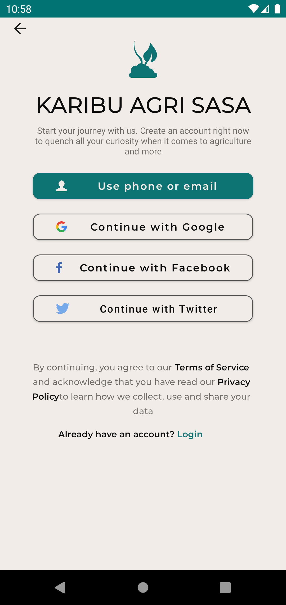
   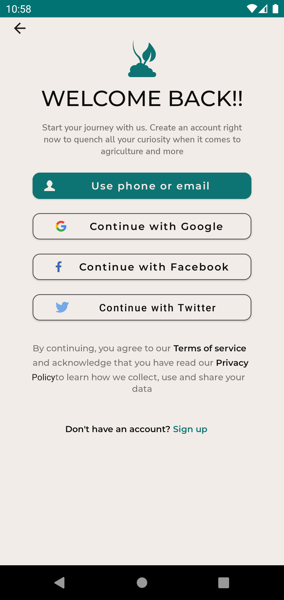
   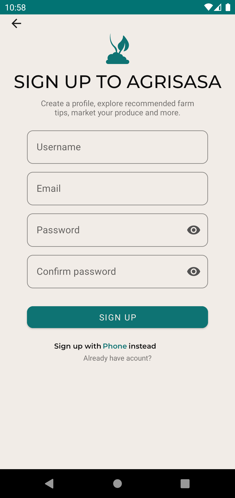
   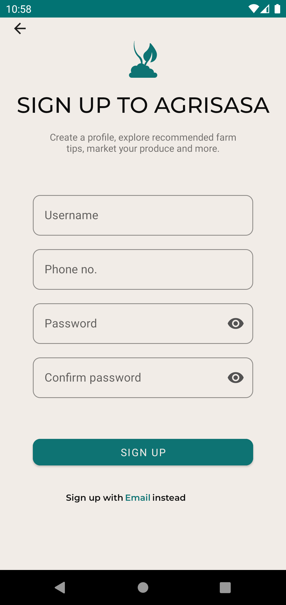
   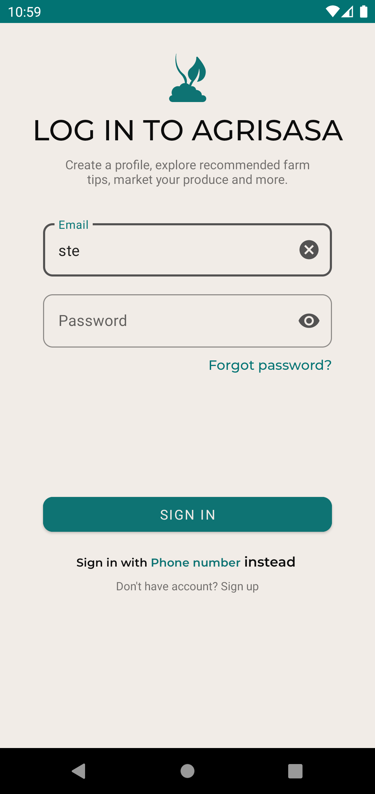
   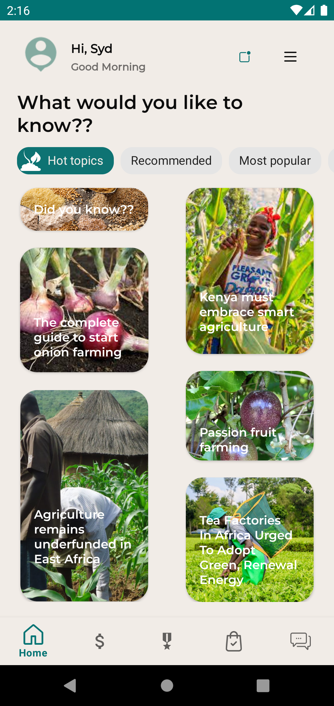
   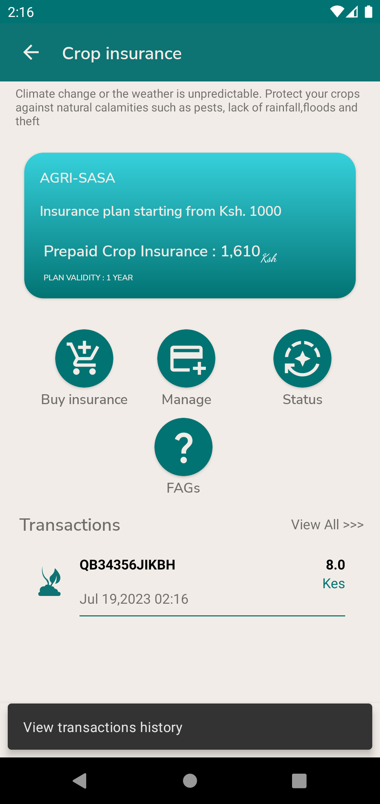
   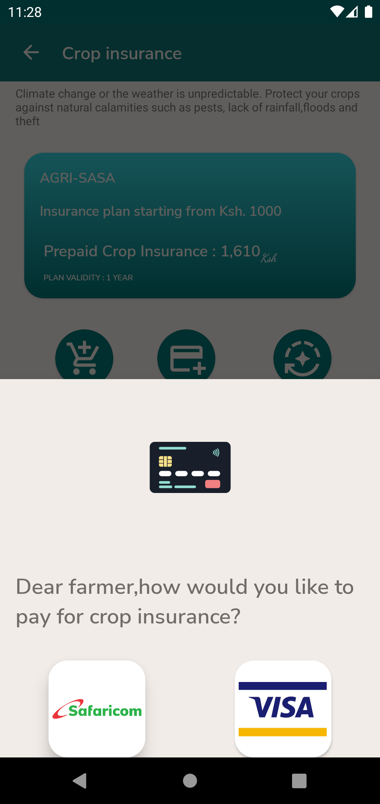
   
   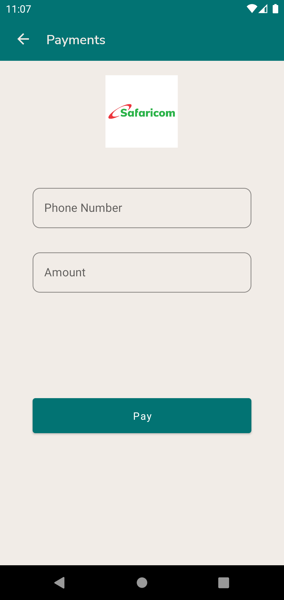
   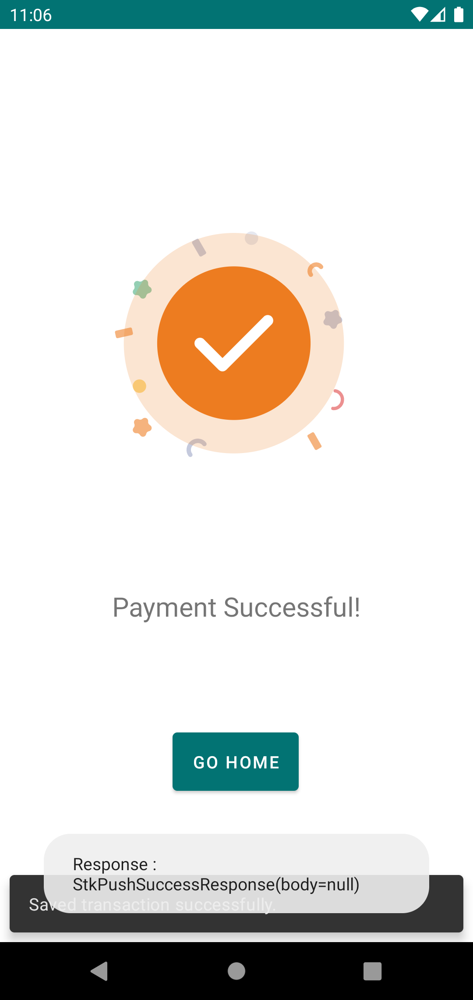
   
   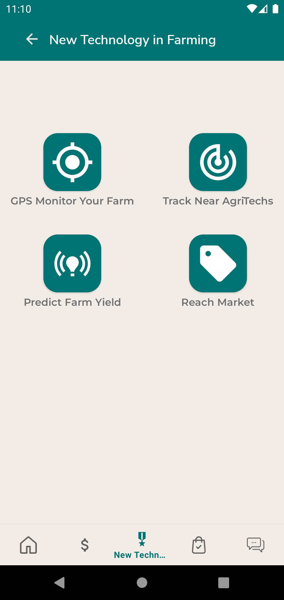
   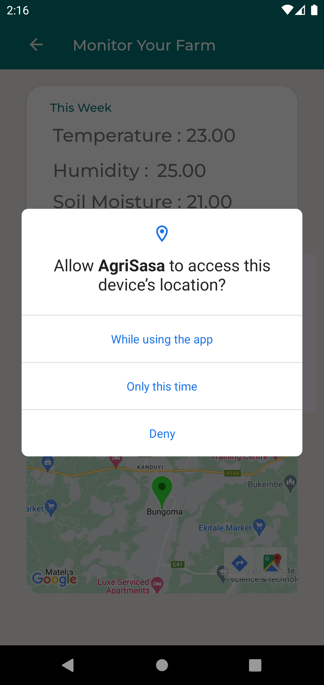
   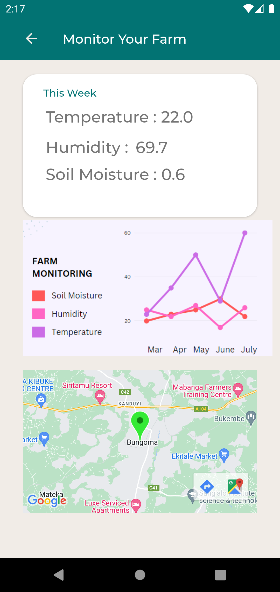
   
   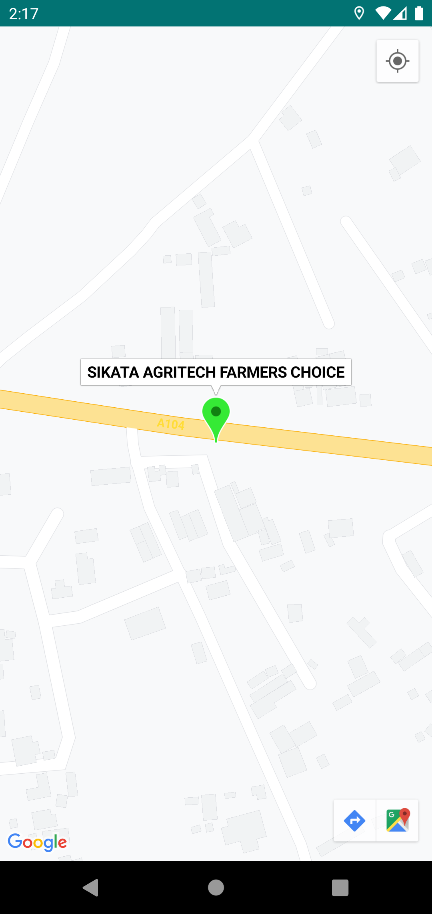
   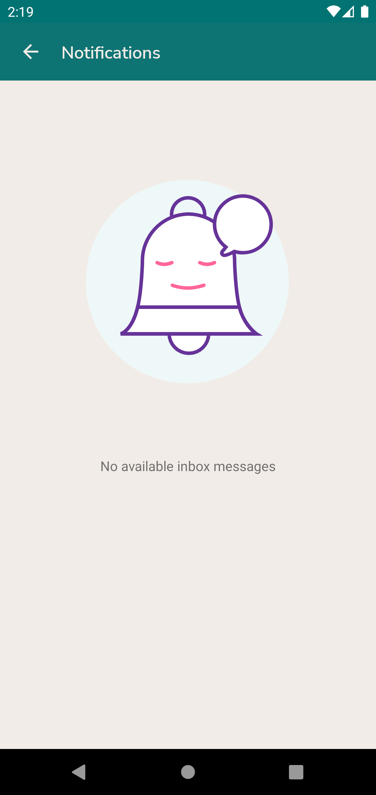
   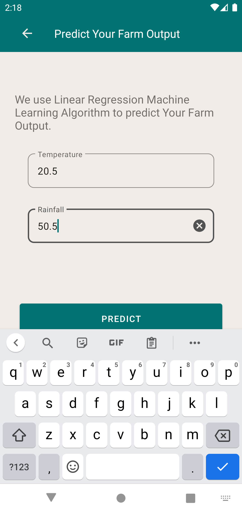
   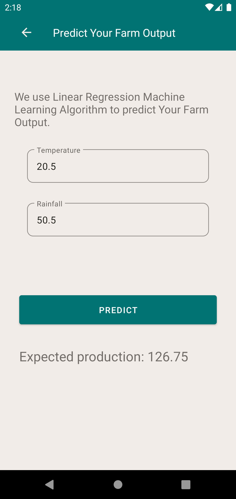
   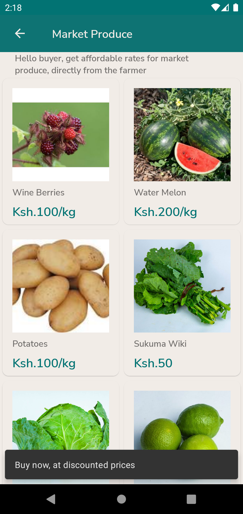
   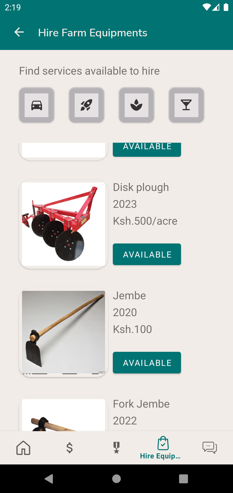
   
   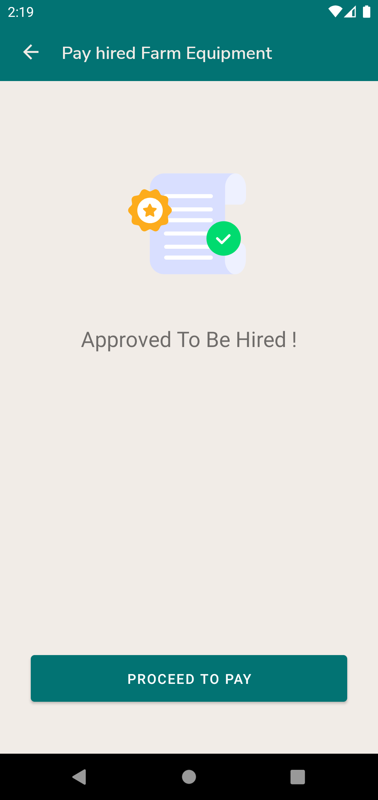
   

</p>


## Tech Stack & Concepts
- 
    * [Kotlin](https://kotlinlang.org/) - a cross-platform, statically typed, general-purpose programming language with type inference.
    * [Coroutines](https://kotlinlang.org/docs/reference/coroutines-overview.html) - perform background operations.
    * [Flow](https://kotlinlang.org/docs/reference/coroutines/flow.html) - handle the stream of data asynchronously that executes sequentially.
    * [Dagger hilt](https://dagger.dev/hilt/) - a pragmatic lightweight dependency injection framework.
    - [Logging Interceptor](https://github.com/square/okhttp/blob/master/okhttp-logging-interceptor/README.md) -  logs HTTP requests and responses data messages and lines and their headers based on their level
    - [MVVM](https://developer.android.com/topic/architecture)- MVVM stands for Model, View, ViewModel. Model: This holds the data of the application. It cannot directly talk to the View. Generally, it's recommended to expose the data to the ViewModel through Observables.
        - [Room database](https://developer.android.com/training/data-storage/room) - The Room persistence library provides an abstraction layer over SQLite to allow fluent database access while harnessing the full power of SQLite.
   - [Kotlin Coroutines](https://developer.android.com/kotlin/coroutines) - A concurrency design pattern that you can use on Android to simplify code that executes asynchronously.
   - [Retrofit](https://square.github.io/retrofit) -  Retrofit is a REST client for Java/ Kotlin and Android by Square inc under Apache 2.0 license. Its a simple network library that is used for network transactions. By using this library we can seamlessly capture JSON response from web service/web API.
  - [GSON](https://github.com/square/gson) - JSON Parser,used to parse requests on the data layer for Entities and understands Kotlin non-nullable and default parameters.
  - [Network bound resource]() - An algorithm that provides an easy function to fetch resource from both database and network
    * [Jetpack](https://developer.android.com/jetpack)
        * [Room](https://developer.android.com/topic/libraries/architecture/room) - a persistence library provides an abstraction layer over SQLite.
        * [LiveData](https://developer.android.com/topic/libraries/architecture/livedata) - is an observable data holder.
        * [Lifecycle](https://developer.android.com/topic/libraries/architecture/lifecycle) - perform action when lifecycle state changes.
        * [ViewModel](https://developer.android.com/topic/libraries/architecture/viewmodel) - store and manage UI-related data in a lifecycle conscious way.

   - [Lottie Animations](https://lottiefiles.com/blog/working-with-lottie/getting-started-with-lottie-animations-in-android-app) - The lottie-android library provides a LottieAnimationView which will take care of rendering your animations for you. Add it to your layouts where you want to place your animations.
   - [Google Map Services](https://developers.google.com/maps/documentation/android-sdk/start)- Maps data, map displays, and map gesture responses. You can also provide additional information for map locations and support user interaction by adding markers, polygons, and overlays to your map.
   - [Linear Regression Algorithm](https://www.javatpoint.com/linear-regression-in-machine-learning) - Linear regression algorithm shows a linear relationship between a dependent (y) and one or more independent (y) variables


## Payment Integration Gateways
 * [Mpesa-Daraja-API](http://developer.safaricom.co.ke/)

## DevOps Tool
- Circle CI

## To Run this App, it's available on Appetize.io

 <p float="center">

  
   
 </p>

## UX Designs Urls
> UX designs are meant to translate the idea or concept of the project into a working prototype
> 1. [Link 1](https://xd.adobe.com/view/df0c0eb0-e5a1-4751-a003-6561680f3e2d-8a5f/grid/)
> 2. [Link 2](https://www.figma.com/file/0JbLHDVNhKGCiquyyo1mKs/Agri-Sasa-%5BShamba-App%5D?type=design&node-id=1-2&mode=design&t=ALIfym3gkeOhoQyV-0)
 
## 
> Important To Note
- CI CD tool is failing
- The App not work exactly as per user preferences but its performance can be improved
- It is a minimum viable product

## TODO
- [ ] - Authentication using POST BACKEND APIs
- [ ] - Configure CI CD workflow

## Issues to Address
> When using backend post apis, i encounter SocketException that is ```D/OkHttp: <-- HTTP FAILED: java.net.SocketException: Socket closed```


##

> Found something to add? Contributions are welcome :)

```
MIT License

Copyright (c) 2023 Stephen Muindi

Permission is hereby granted, free of charge, to any person obtaining a copy
of this software and associated documentation files (the "Software"), to deal
in the Software without restriction, including without limitation the rights
to use, copy, modify, merge, publish, distribute, sublicense, and/or sell
copies of the Software, and to permit persons to whom the Software is
furnished to do so, subject to the following conditions:

The above copyright notice and this permission notice shall be included in all
copies or substantial portions of the Software.

THE SOFTWARE IS PROVIDED "AS IS", WITHOUT WARRANTY OF ANY KIND, EXPRESS OR
IMPLIED, INCLUDING BUT NOT LIMITED TO THE WARRANTIES OF MERCHANTABILITY,
FITNESS FOR A PARTICULAR PURPOSE AND NONINFRINGEMENT. IN NO EVENT SHALL THE
AUTHORS OR COPYRIGHT HOLDERS BE LIABLE FOR ANY CLAIM, DAMAGES OR OTHER
LIABILITY, WHETHER IN AN ACTION OF CONTRACT, TORT OR OTHERWISE, ARISING FROM,
OUT OF OR IN CONNECTION WITH THE SOFTWARE OR THE USE OR OTHER DEALINGS IN THE
SOFTWARE.
```


